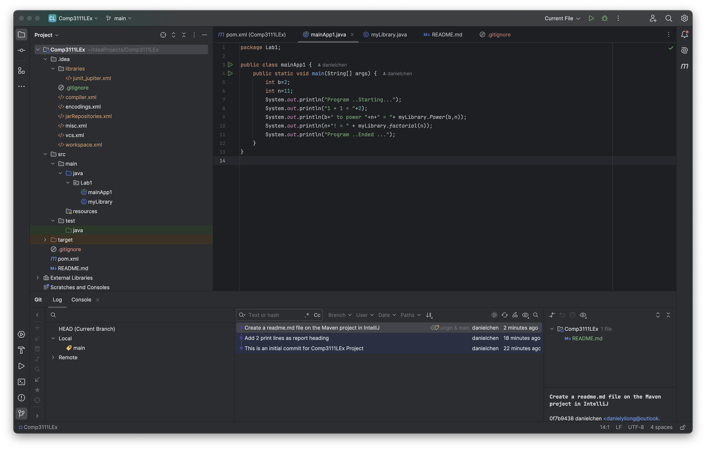

# COMP3111 Lab 1 Exercise

### Objectives:
- Use IntelliJ IDEA to create the Git Repository and place a Java Project under version control. 
- Learn how to commit changes and other Git operations.
- Create a GitHub account and keep track of changes in the remote repository.

### Screenshot:
